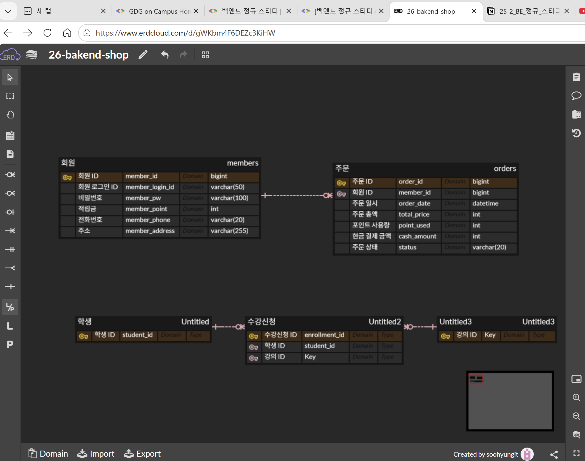
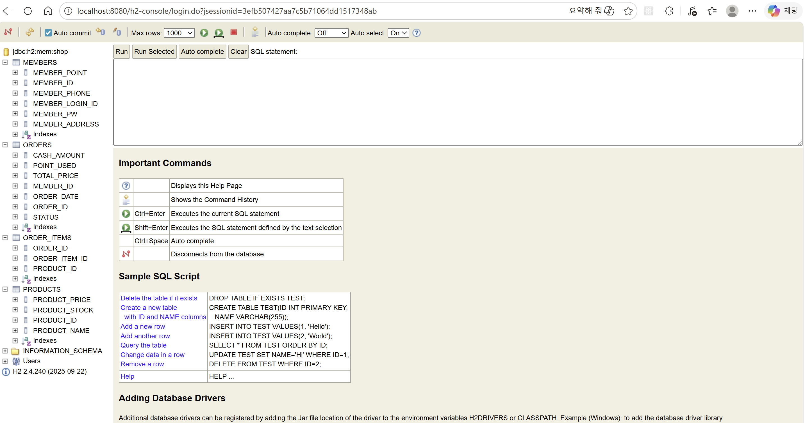

ERD, DB , 엔티티 학습
-ERD = 데이터 청사진. 개체 - 관계 중심의 모델링 기법: ER Model

-엔티티 : 관리해야할 데이터 주체.

-기본 키(primary key) : member_id , product_id, order_id
고유하게 식별하는데 사용하는 하나 이상의 필드.
대체로 id값을 기본 키라고 생각하는것이 가장 직관적인 이해를 돕는것 같다.

-외래 키(foreign key) : 다른 테이블의 PK를 참조하는 속성.
즉 다른 테이블의 기본 키(PK)를 우리 테이블에 참조하는것이다.
서로를 연결하는 연결고리라고 생각하면 될거같다

-관계 : entity 사이의 연관성, 업무 규칙
다대일(N:1) , 일대다(1:N) , 일대일(1:1) , 다대다(N:M)

-일대다 (1:N)
1 명의 회원이 여러개의 주문 내역을 갖는다.

Member (1) : Order (N)
Order 테이블은 member_id를 FK로 갖는다.

-다대다 (N:M)
한개의 주문 내역이 여러 상품을 갖는다.
한개의 상품이 여러개의 주문내역을 갖는다.

이런 다대다 관계는 다른 테이블을 하나 설정해서 그것을 통해

주문 내역 (1:N) 다른 테이블 , 다른 테이블 (M :1 ) 상품과 같이 
관계를 나타낼 수 있다.
이를 테스트 해보기 위해 ERD를 활용해 직관적인 이해를 할수있었음